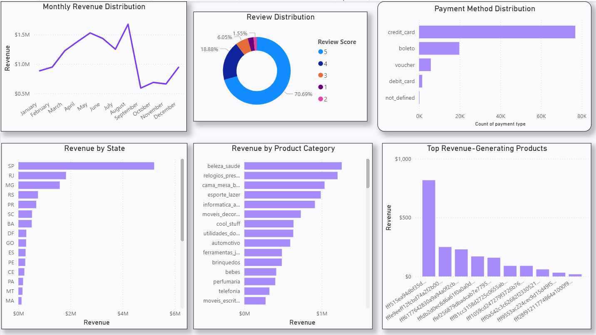
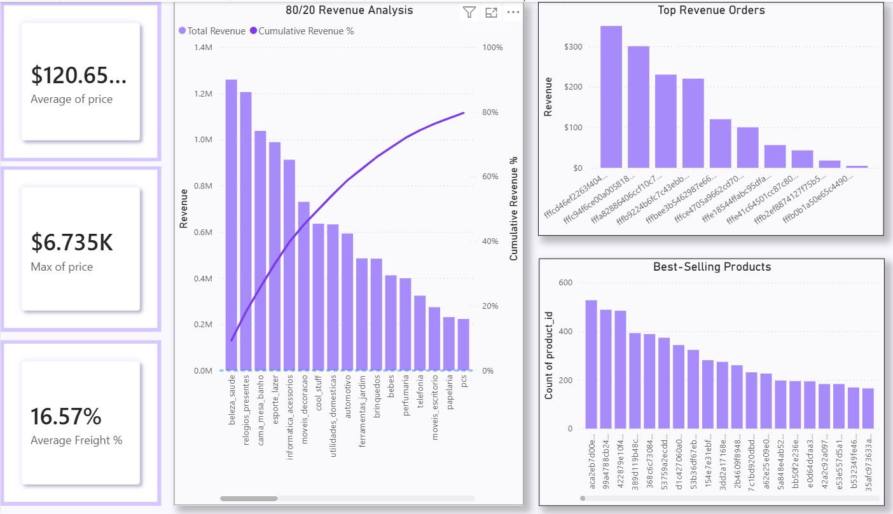
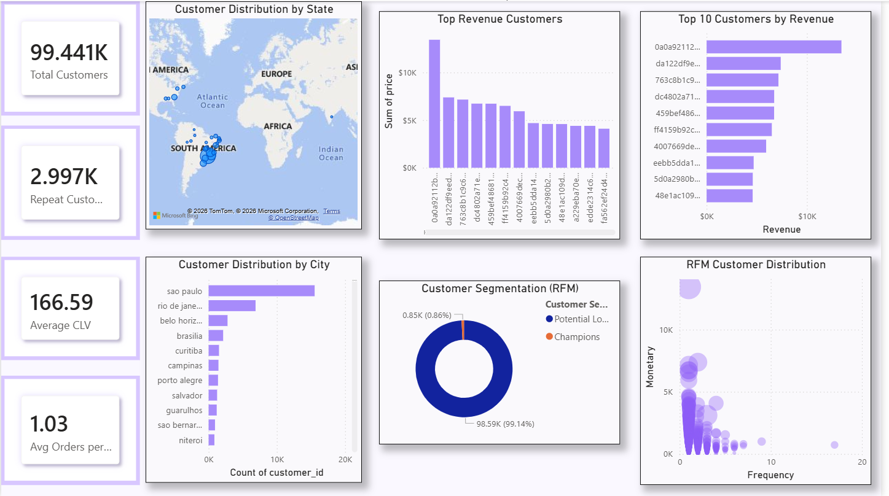
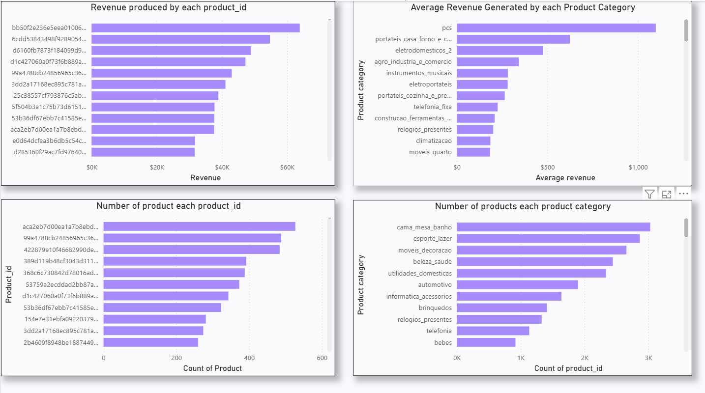
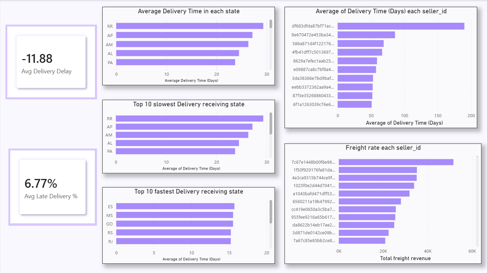
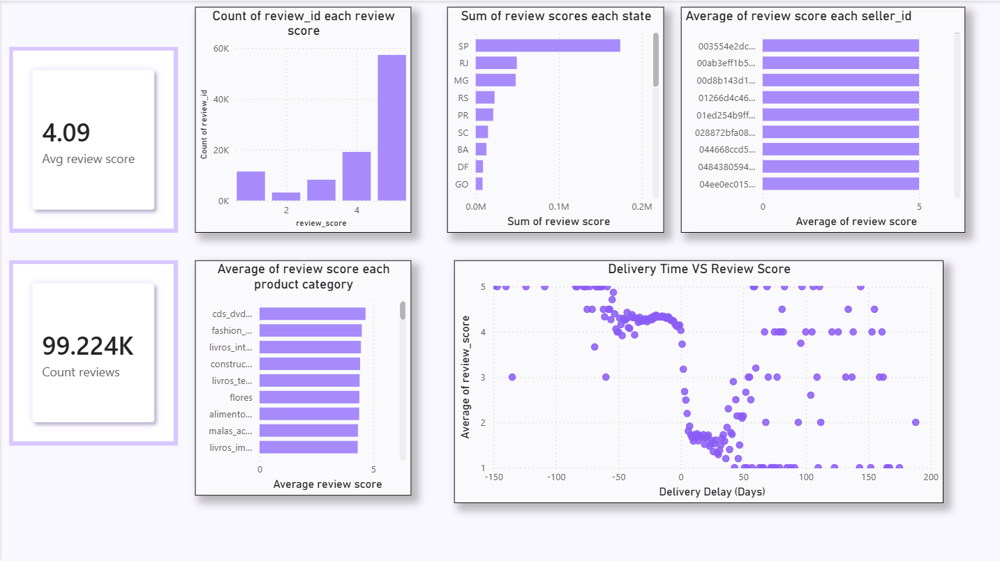

# 🛒 Olist E-Commerce Analytics Dashboard

An end-to-end **E-Commerce Analytics Project** built using **PostgreSQL** and **Power BI** to analyze over **100,000+ customer orders** from the Brazilian Olist marketplace.

The project covers the complete analytics workflow—from SQL data preparation and business analysis to an interactive Power BI dashboard for decision-making.

---

## 📌 Project Overview

This project analyzes the Olist E-Commerce dataset to answer key business questions related to:

- Sales Performance
- Customer Behaviour (RFM Analysis)
- Product Performance
- Logistics & Delivery
- Customer Reviews

The insights are presented through an interactive multi-page Power BI dashboard.

---

## 🛠 Tech Stack

- PostgreSQL
- Power BI
- SQL
- DAX
- Data Visualization

---

## 📊 Dashboard Pages

### 1. Overview
- Business KPIs
- Executive Business Summary
- Interactive Filters

### 2. Sales Analysis
- Revenue Distribution
- Monthly Revenue Trend
- Pareto Analysis
- Payment Type Analysis

### 3. Customer Analysis
- Customer Segmentation (RFM)
- Repeat Customer Analysis
- Customer Distribution
- Customer Revenue

### 4. Product Analysis
- Product Revenue
- Product Category Performance
- Product Demand Analysis

### 5. Logistics Analysis
- Delivery Time Analysis
- Late Delivery Analysis
- Freight Cost Analysis
- Seller Performance

### 6. Review Analysis
- Review Score Distribution
- Review vs Delivery Time
- Product Review Analysis
- Seller Review Analysis

---

## 📈 Key Business Insights

- Generated **$13.59M** revenue from **112.65K** completed orders.
- Served **99.44K** unique customers.
- Only **6.77%** of deliveries were delayed.
- Average delivery time was **12.5 days**.
- Average customer rating was **4.09 / 5**.
- São Paulo generated the highest revenue.
- Beauty & Health was the highest revenue-generating product category.

---

## 📂 Repository Structure

```
.
├── images/
│   ├── overview.png
│   ├── sales.png
│   ├── customers.png
│   ├── products.png
│   ├── logistics.png
│   └── reviews.png
│
├── sql/
│   ├── 01_database_setup.sql
│   ├── 02_data_validation.sql
│   ├── 03_eda.sql
│   ├── 04_sales_analysis.sql
│   ├── 05_customer_analysis.sql
│   ├── 06_product_analysis.sql
│   ├── 07_logistics_analysis.sql
│   └── 08_reviews_analysis.sql
│
├── README.md
└── LICENSE
```

---

## 🖼 Dashboard Preview

### Overview



### Sales



### Customers



### Products



### Logistics



### Reviews



---

## 📌 Dataset

**Source:** Olist Brazilian E-Commerce Public Dataset

https://www.kaggle.com/datasets/olistbr/brazilian-ecommerce

---

## ⚠️ Note

The Power BI (.pbix) file is not included because it exceeds GitHub's file size limit.

The repository contains:

- SQL scripts
- Dashboard screenshots
- Project documentation

---

## 👨‍💻 Author

**Utkarsh Yadav**

GitHub: https://github.com/uttkarshyadavv
